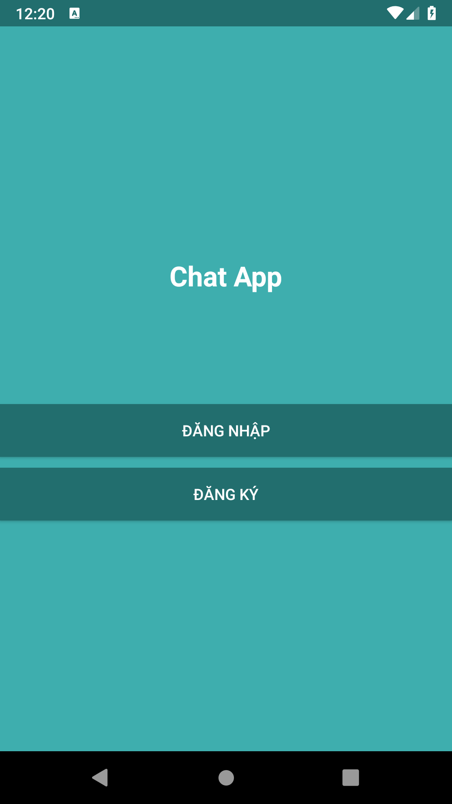
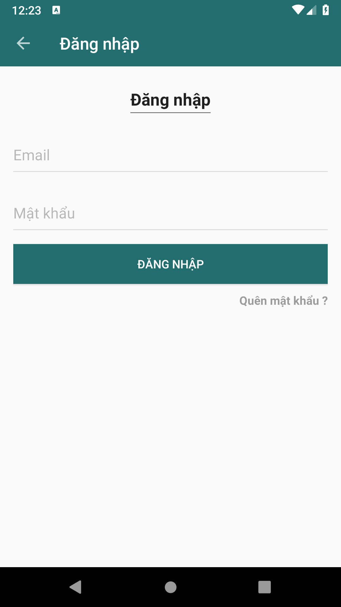
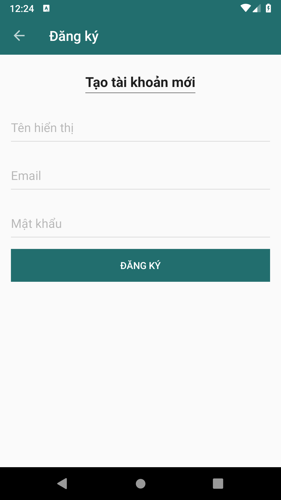
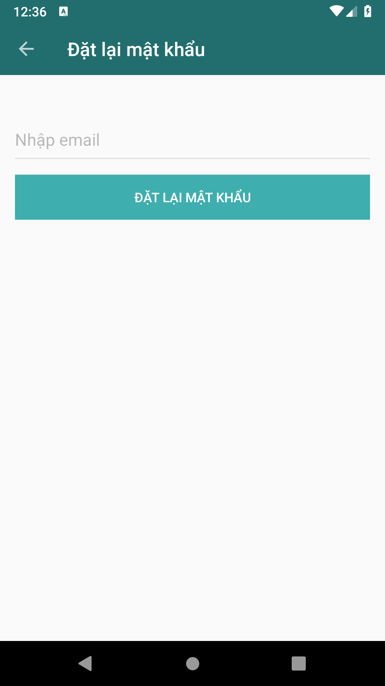
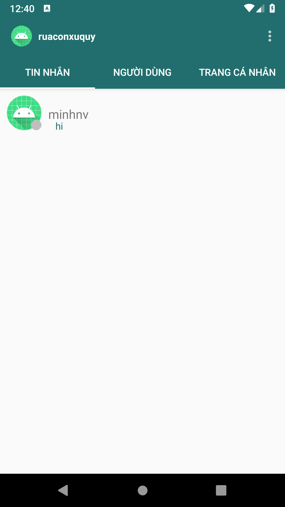
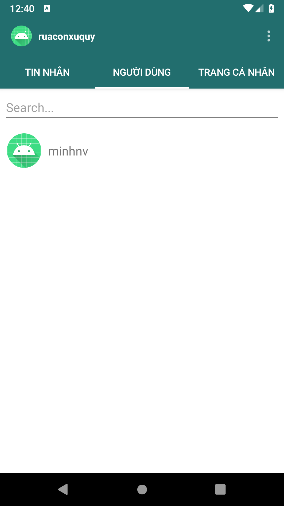
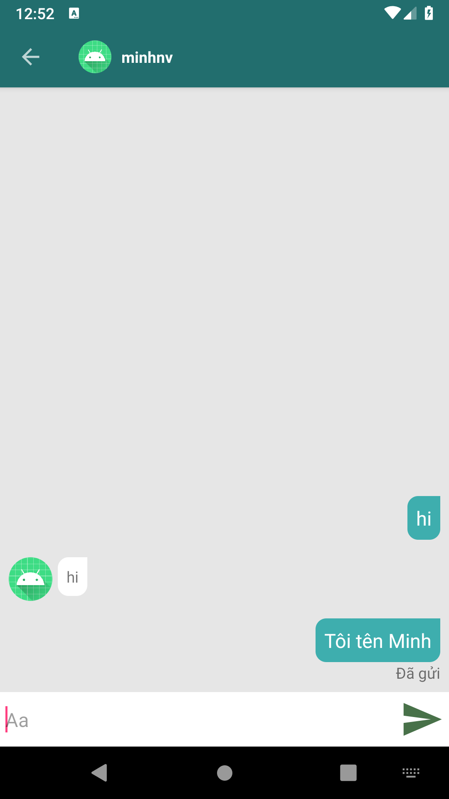

# Chat Application

Ứng dụng giúp bạn nhắn tin với người khác.

## Nội dung
1. [Chức năng](#chức-năng)
   
   1. [Đăng nhập, Đăng ký](#đăng-nhập-đăng-ký)

   1. [Reset mật khẩu](#reset-mật-khẩu)
   
   1. [Tin nhắn](#tin-nhắn)
   
   1. [Danh sách người dùng](#danh-sách-người-dùng)
   
   1. [Thông tin cá nhân](#thông-tin-cá-nhân)
   
   1. [Chat](#chat)
   
1. [Yêu cầu thiết bị](#yêu-cầu-thiết-bị)

1. [Thư viện và công nghệ](#thư-viện-và-công-nghệ)

1. [Tác giả](#tác-giả)

1. [Giấy phép](#giấy-phép)

## Chức năng
### Đăng nhập Đăng ký
   * Đăng nhập
   
   * Đăng ký
   
   

     
   

   
### Reset mật khẩu
   * Reset mật khẩu
   
   

   
   

   
### Tin nhắn   
   * Trạng thái hoạt động
   
   * Tin nhắn cuối cùng
   
   

   
   
### Danh sách người dùng
   * Danh sách người dùng
   
   * Tìm kiếm người dung
   
   

   
   

### Thông tin cá nhân
   * Thông tin cá nhân
   
   * Đổi ảnh đại diện
   
   

   
   

   
### Chat
   * Chat
   
   * Trạng thái tin nhắn
   
   

   
   

 
   
## Yêu cầu thiết bị
-Android:

   +Android studio : 
   
   +Gradle : 
   
   +Min sdk : 16

   +Target sdk : 

## Thư viện và công nghệ

- Language : Java

- FrameWork : 

- Database: Firebase

* react-native - https://github.com/facebook/react-native

* react-navigation - https://github.com/react-navigation/react-navigation

* react-native-maps - https://github.com/react-native-community/react-native-maps

* react-native-swiper - https://github.com/leecade/react-native-swiper

* react-native-linear-gradient - https://github.com/react-native-community/react-native-linear-gradient

* react-native-view-more-text - https://github.com/nlt2390/react-native-view-more-text

## Tác giả
Nguyễn Văn Minh - 1752057@gm.uit.edu.vn

## Giấy phép

    Copyright 2014

    Licensed under the Apache License, Version 2.0 (the "License");
    you may not use this file except in compliance with the License.
    You may obtain a copy of the License at

       http://www.apache.org/licenses/LICENSE-2.0

    Unless required by applicable law or agreed to in writing, software
    distributed under the License is distributed on an "AS IS" BASIS,
    WITHOUT WARRANTIES OR CONDITIONS OF ANY KIND, either express or implied.
    See the License for the specific language governing permissions and
    limitations under the License.
